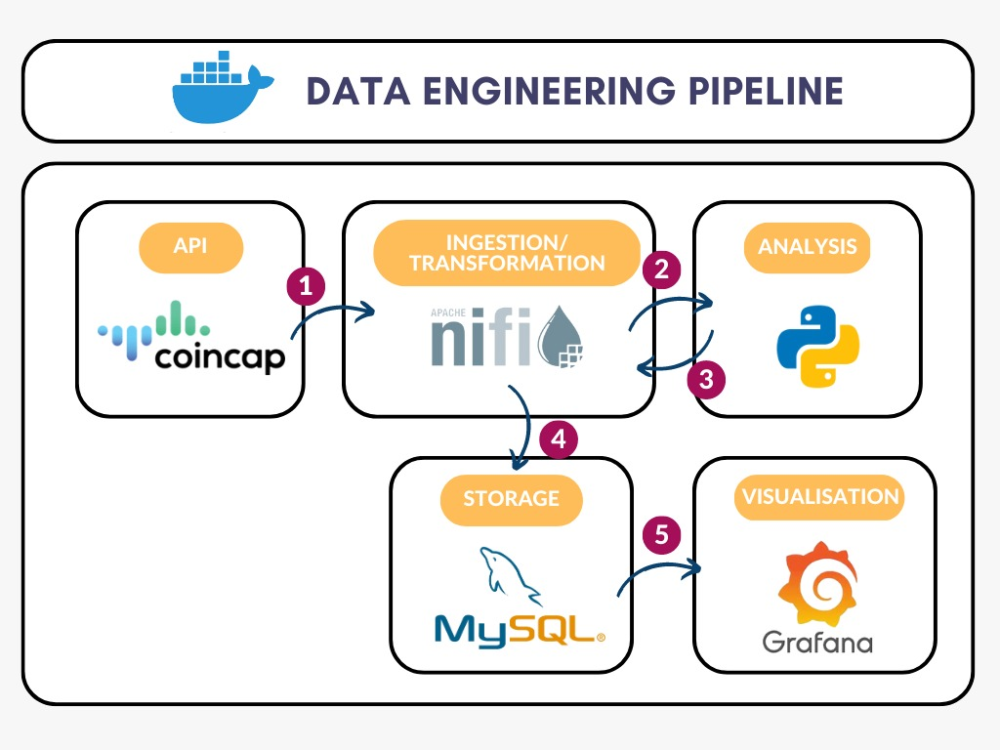

# Real-Time Cryptocurrency Price Forecasting System

## Introduction
This repository contains the environment and documentation for a real-time cryptocurrency price forecasting system. The system is designed to efficiently ingest and process high-velocity data from the CoinCap API, apply an ARIMA model for forecasting, store the results in a MySQL database, and visualize the data using Grafana. 

### Authors
- Yi-Chun Huang
- Contact: dino.1g.yc@gmail.com

### Additional Keywords
Data Engineering, Real-time Data Processing, Cryptocurrency Price Forecasting, Apache NiFi, Python, ARIMA Model, MySQL, Grafana, CoinCap API

## Background
Cryptocurrency price forecasting has become increasingly important in the financial world. Various methods have been used to predict cryptocurrency prices, including traditional statistical models and complex machine learning algorithms. One widely applied method is the ARIMA model, known for its effectiveness in time series forecasting.

## Datasets and Characteristics
The data used for this project is sourced from the CoinCap API, a reliable resource for real-time cryptocurrency data. The data is characterized by its high volume, frequent updates, authenticity, diversity, and real-time nature.

## Design Approach
The system is designed as a data processing pipeline with several stages:
1. **Ingestion:** Data is ingested in real-time from the CoinCap API using Apache NiFi.
2. **Transformation:** Data is cleaned and prepared for analysis, including data consistency and error handling.
3. **Analysis:** An ARIMA model implemented in Python is used for forecasting.
4. **Storage:** The raw and forecasted data is stored in a MySQL database.
5. **Visualization:** Grafana is used to create interactive dashboards for visualizing the data and predictions.

## Implementation
The implementation stack includes Apache NiFi, Python, MySQL, and Grafana, all integrated within Docker containers. Apache NiFi handles data ingestion and transformation, Python implements the ARIMA model, MySQL stores the data, and Grafana provides data visualization.

## Evaluation
The system has been found to efficiently handle real-time data ingestion, transformation, and storage. The ARIMA model performs well, and Grafana provides valuable data visualization capabilities.

## Concluding Remarks
This project demonstrates the power of a well-designed data engineering pipeline for real-time data processing. While the system is effective, there is room for improvement, such as integrating offline optimization and experimenting with different forecasting models.

## References
- [Reference 1](https://example.com/reference1)
---
output:
  md_document:
    variant: markdown_github
bibliography: bibliography.bib
---

[@khan2020arima]
